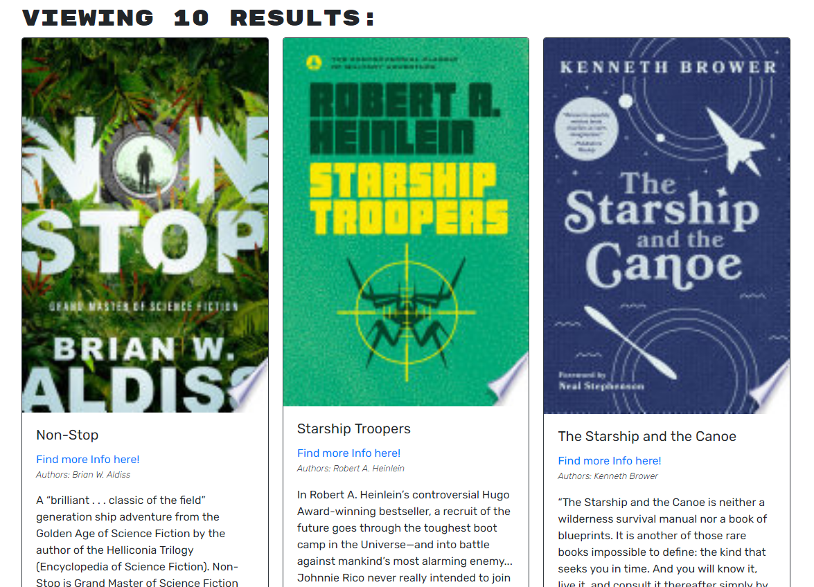
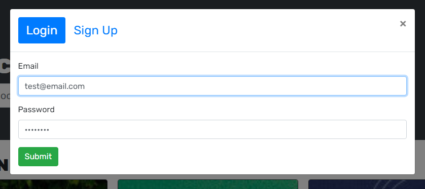
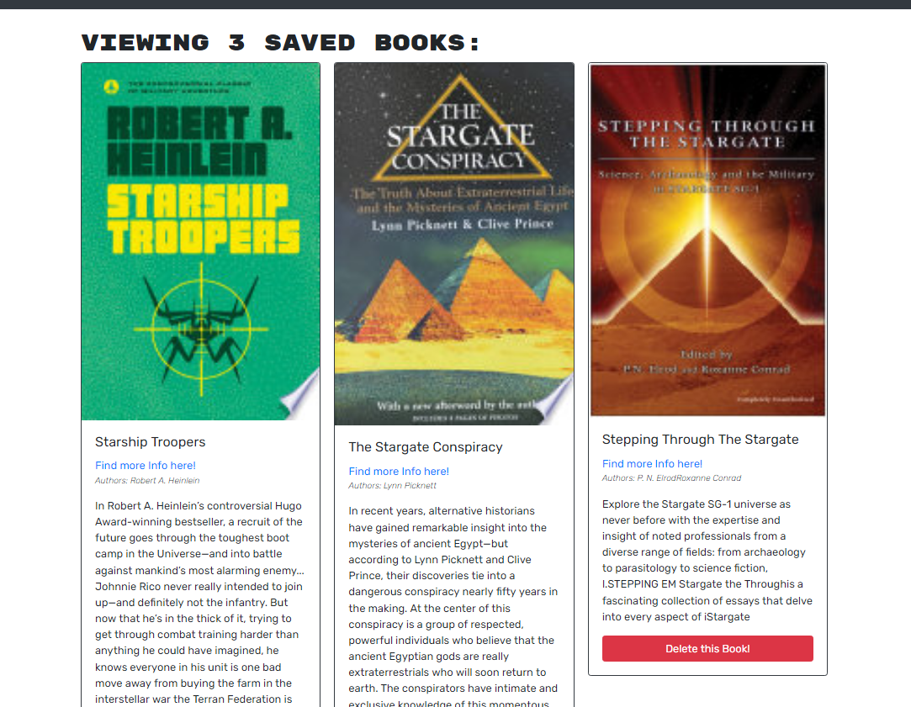

# Book Search Engine

## Table of Contents

- [Book Search Engine](#book-search-engine)
  - [Table of Contents](#table-of-contents)
  - [Description](#description)
  - [Deployment](#deployment)
  - [Installation](#installation)
  - [Usage](#usage)
  - [Contributing](#contributing)
  - [Tests](#tests)
  - [License](#license)
  - [Screenshots](#screenshots)
  - [Questions](#questions)

## Description

A project for my bootcamp to convert the REST api used by a full stack application to use a GraphQL api. This conversion was by adding an Apollo server to the program, and creating queries, mutations, and resolvers that matched the previous REST calls. The code on the client side was then replaced to make graphQL calls. 

The Application itself allows users to search books, and after creating an account, save there favorites to a personal list.

## Deployment

[You can find a heroku deployment of this app here.](https://immense-tor-56342.herokuapp.com/)

## Installation

You can run your own version of this program by downloading it from the repository. Then, in the terminal pointing at the repo, run `npm install`. Once it is done running, run `npm run develop` to launch a local version of the program to start developing changes. 
>NOTE: You will need to have MongoDB install as well to run this program.

## Usage

On the front page, you can enter a book title into the search bar and hit enter. You will then be presented with a list of books and there descriptions. To save your favorite books to a personal list, click the login/signup in the upper right corner, and either sign in and sign up according. You will then be able to save any searched books with the save button below their descriptions. Finally, you can view your saved books in the corresponding tag, and remove any you don't want anymore.

## Contributing

Anyone can fork this project and add features. However, all changes to the main section must be approved by the Admin.

## Tests

There are no testing procedures for this project.

## License

This project is licensed under a [MIT license](https://opensource.org/licenses/MIT).

## Screenshots

## Questions

If you have any questions, please send them to [WRuback](https://github.com/WRuback) at wrubackdev@gmail.com with the heading "Book Search Engine Question".
